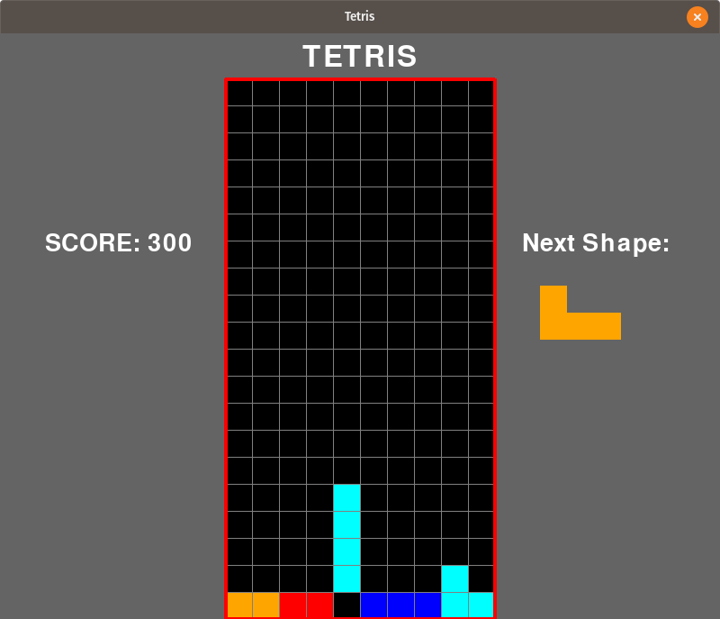

# Tetris

My version of a Tetrominoes game that I made using [pygame](https://www.pygame.org/news). This project was developed as a sub-task for another project while implementing it in an <b>Object Oriented Manner</b>. Each line of code is accompanied by a comment to explain it better.

### Files in the Repository - 
The files in the repository are :

#### README.md
The Description file containing details about the repository. The file that you looking at right now.

#### \_\_init__.py
The \_\_init__.py file is to make Python treat directories containing the file as packages.

#### global_variables.py
This file contains the global variables that are used in the game such as `SCREEN_WIDTH, SCREEN_HEIGHT,` etc.

#### main.py
This file is contains the game and its working. To play the game, use -<br>

```bash
python3 main.py
```

#### piece.py
This file contains the class templates for the various shapes of pieces in the game i.e. `Piece class`.

#### shapes.py
This file contains the shapes of each of the game pieces as lists of lists, it also contains information about the color of each block in RGB format.

#### tetris.py
This file contains the class template for the main game-play i.e. `Tetris class`.

#### requirements.txt
This file contains the respective packages needed to be installed. To install the respective packages, use -

```bash
pip3 install -r requirements.txt

or 

pip install -r requirements.txt
```  

#### .images
This directory contains the images for the game icon and README File.

## Game Image -



## Bibliography
-  <b>Reference:</b> https://www.youtube.com/watch?v=zfvxp7PgQ6c&t=5137s by [freeCodeCamp.org](https://www.youtube.com/channel/UC8butISFwT-Wl7EV0hUK0BQ).
-  <b>Scoring Chart:</b> The scoring is from the Tetris (BPS) version of this game. You can read about it [here](https://tetris.wiki/Tetris_(BPS)#Scoring).
- <b>Game Icon:</b> Icons made by [Freepik](https://www.flaticon.com/authors/freepik) from [flaticons.com](https://www.flaticon.com/).

[]( https://github.com/shashank3199 )